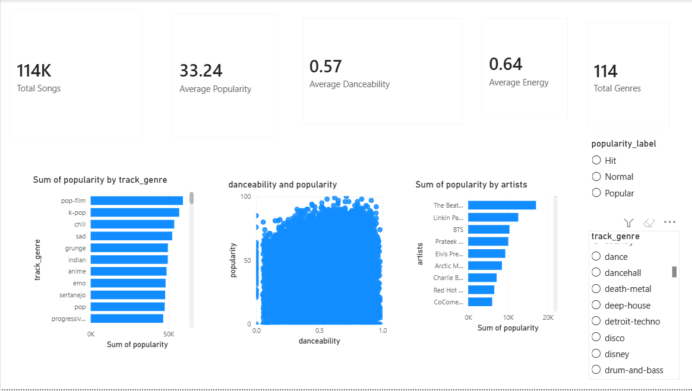

# Spotify Power BI Dashboard

## Overview
This project focuses on building an interactive Spotify Analytics Dashboard using Power BI.

## Dashboard Features
- KPI Cards
- Genre Popularity Analysis
- Artist Popularity Analysis
- Danceability vs Popularity Scatter Plot
- Interactive Filters and Slicers

---

# Dashboard Preview

---

## Technologies Used
- Power BI
- Data Visualization
- Business Intelligence
- Spotify Dataset

## Objective
Generate business intelligence insights from Spotify songs data using interactive visual analytics.

## Author
ROKKAM GUNA SEKHAR
